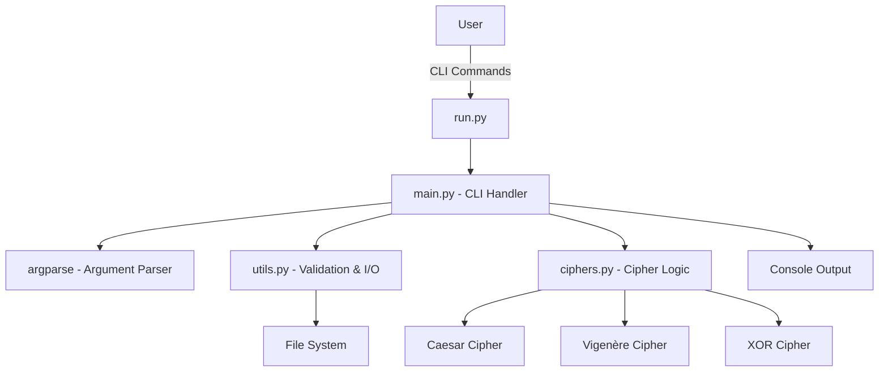

# Cipher Tool - Comprehensive Project Report

**Project Name:** py-Cipher-Tool  
**Author:** John Varghese (@Cyber_Trinity) J0X  
**Repository:** [py-Cipher-Tool](https://github.com/John-Varghese-EH/py-Cipher-Tool)  
**Purpose:** Python Project for Classical Cryptography

---

## Table of Contents

1. [Executive Summary](#executive-summary)
2. [Project Overview](#project-overview)
3. [Technical Architecture](#technical-architecture)
4. [Features and Functionality](#features-and-functionality)
5. [Implementation Details](#implementation-details)
6. [Testing and Validation](#testing-and-validation)
7. [Usage Examples](#usage-examples)
8. [Project Structure](#project-structure)
9. [Design Decisions](#design-decisions)
10. [Future Enhancements](#future-enhancements)
11. [Conclusion](#conclusion)

---

## Executive Summary

The **Cipher Tool** is a compact, modular Python application designed for educational purposes, demonstrating classical encryption and decryption techniques through a clean command-line interface (CLI). The project implements three classical ciphers: **Caesar**, **Vigenère**, and **XOR**, supporting both text and file-based encryption/decryption operations.

### Key Highlights

- **Zero External Dependencies:** Built entirely using Python's standard library
- **Modular Architecture:** Clean separation of concerns (CLI, Logic, Utilities)
- **Dual Mode Operation:** Supports both text and file processing
- **Educational Focus:** Clear, readable code with comprehensive documentation
- **Cross-Platform:** Compatible with Windows, Linux, and macOS

### Project Statistics

| Metric | Value |
|--------|-------|
| Total Lines of Code | ~400 |
| Number of Modules | 3 (main, ciphers, utils) |
| Test Coverage | Core cipher functions |
| Supported Ciphers | 3 (Caesar, Vigenère, XOR) |
| Python Version | 3.6+ |

---

## Project Overview

### Background

Classical ciphers form the foundation of modern cryptography. This project serves as an educational tool to understand encryption principles, algorithm implementation, and software design patterns in Python.

### Objectives

1. **Educational Value:** Provide clear, understandable implementations of classical ciphers
2. **Practical Application:** Enable users to encrypt/decrypt text and files
3. **Code Quality:** Demonstrate best practices in Python development
4. **Modularity:** Showcase separation of concerns and reusable components
5. **User Experience:** Deliver an intuitive CLI with visual feedback

### Target Audience

- Computer Science students learning cryptography
- Python learners exploring modular project structure
- Educators teaching classical encryption techniques
- Developers interested in CLI application design

---

## Technical Architecture

### System Architecture Diagram



### Component Overview

| Component | File | Responsibility |
|-----------|------|----------------|
| **Entry Point** | `run.py` | Application launcher |
| **CLI Interface** | `main.py` | Argument parsing, user interaction, workflow orchestration |
| **Cipher Logic** | `ciphers.py` | Implementation of encryption/decryption algorithms |
| **Utilities** | `utils.py` | File I/O, input validation, helper functions |
| **Tests** | `tests.py` | Unit tests for ciphers and utilities |

### Technology Stack

- **Language:** Python 3.6+
- **Standard Library Modules:**
  - `argparse` - Command-line argument parsing
  - `os` - Operating system interface
  - `sys` - System-specific parameters
  - `unittest` - Testing framework

---

## Features and Functionality

### Supported Ciphers

#### 1. Caesar Cipher

**Description:** A substitution cipher that shifts each letter by a fixed number of positions in the alphabet.

**Key Type:** Integer (shift value)

**Algorithm:**
- Encryption: `E(x) = (x + shift) mod 26`
- Decryption: `D(x) = (x - shift) mod 26`

**Use Cases:**
- Basic encryption demonstrations
- Understanding modular arithmetic
- Introduction to cryptanalysis

**Screenshot Placeholder:**

> [!NOTE]
> **Screenshot 1:** Caesar cipher encryption example
> 
> *[Add screenshot showing Caesar cipher encrypting "Hello World" with shift 3]*

---

#### 2. Vigenère Cipher

**Description:** A polyalphabetic substitution cipher using a keyword to determine shift values.

**Key Type:** String (alphabetic keyword)

**Algorithm:**
- Uses repeating keyword to determine shift for each character
- More secure than Caesar cipher due to varying shifts

**Use Cases:**
- Demonstrating polyalphabetic ciphers
- Understanding key-based encryption
- Historical cipher analysis

**Screenshot Placeholder:**

> [!NOTE]
> **Screenshot 2:** Vigenère cipher encryption example
> 
> *[Add screenshot showing Vigenère cipher with keyword "KEY"]*

---

#### 3. XOR Cipher

**Description:** A bitwise operation cipher that XORs data with a repeating key.

**Key Type:** String or bytes

**Algorithm:**
- `result[i] = data[i] XOR key[i mod len(key)]`
- Symmetric: encryption and decryption are identical

**Use Cases:**
- Binary file encryption
- Understanding bitwise operations
- Stream cipher concepts

**Screenshot Placeholder:**

> [!NOTE]
> **Screenshot 3:** XOR cipher binary file encryption
> 
> *[Add screenshot showing XOR cipher encrypting a binary file]*

---

### Operation Modes

#### Text Mode

**Purpose:** Direct encryption/decryption of text strings via CLI

**Features:**
- Immediate output to console
- Suitable for quick demonstrations
- Preserves non-alphabetic characters (Caesar/Vigenère)

**Screenshot Placeholder:**

> [!NOTE]
> **Screenshot 4:** Text mode operation
> 
> *[Add screenshot showing text mode encryption with colored output]*

---

#### File Mode

**Purpose:** Encrypt/decrypt entire files

**Features:**
- Supports text files (Caesar/Vigenère)
- Supports binary files (XOR)
- Output saved to specified file
- Preserves file integrity

**Screenshot Placeholder:**

> [!NOTE]
> **Screenshot 5:** File mode operation
> 
> *[Add screenshot showing file encryption and output confirmation]*

---

## Implementation Details

### Module: `main.py` - CLI Interface

#### Banner Display

The application features a colorful ASCII art banner with ANSI color support:

```python
 $$$$$$\  $$\           $$\                                 $$$$$$$$\                  $$\ 
$$  __$$\ \__|          $$ |                                \__$$  __|                 $$ |
$$ /  \__|$$\  $$$$$$\  $$$$$$$\   $$$$$$\   $$$$$$\           $$ | $$$$$$\   $$$$$$\  $$ |
$$ |      $$ |$$  __$$\ $$  __$$\ $$  __$$\ $$  __$$\          $$ |$$  __$$\ $$  __$$\ $$ |
$$ |      $$ |$$ /  $$ |$$ |  $$ |$$$$$$$$ |$$ |  \__|         $$ |$$ /  $$ |$$ /  $$ |$$ |
$$ |  $$\ $$ |$$ |  $$ |$$ |  $$ |$$   ____|$$ |               $$ |$$ |  $$ |$$ |  $$ |$$ |
\$$$$$$  |$$ |$$$$$$$  |$$ |  $$ |\$$$$$$$\ $$ |               $$ |\$$$$$$  |\$$$$$$  |$$ |
 \______/ \__|$$  ____/ \__|  \__| \_______|\__|               \__| \______/  \______/ \__|
              $$ |                                                                         
              $$ |                                                  By: John Varghese (J0X)
              \__|                                                                         
                    >> Classical Encryption & Decryption Utility <<
```

**Screenshot Placeholder:**

> [!NOTE]
> **Screenshot 6:** Application banner
> 
> *[Add screenshot showing the colorful CLI banner on startup]*

---

#### Argument Parsing

The CLI uses `argparse` for robust command-line argument handling:

**Positional Arguments:**
- `mode`: `text` or `file`
- `operation`: `encrypt` or `decrypt`
- `cipher`: `caesar`, `vigenere`, or `xor`

**Optional Arguments:**
- `--key`: Cipher key (required)
- `--input`: Input text or filename (required)
- `--output`: Output filename (required for file mode)

**Example Command:**
```bash
python run.py text encrypt caesar --key 3 --input "Hello World"
```

---

### Module: `ciphers.py` - Encryption Logic

#### Caesar Cipher Implementation

```python
def caesar_cipher(text, shift, decrypt=False):
    """
    Encrypts or decrypts text using the Caesar cipher.
    """
    if decrypt:
        shift = -shift
        
    result = []
    for char in text:
        if char.isalpha():
            start = ord('A') if char.isupper() else ord('a')
            new_char = chr((ord(char) - start + shift) % 26 + start)
            result.append(new_char)
        else:
            result.append(char)
            
    return "".join(result)
```

**Key Features:**
- Preserves case (uppercase/lowercase)
- Non-alphabetic characters remain unchanged
- Modular arithmetic for wraparound

---

#### Vigenère Cipher Implementation

```python
def vigenere_cipher(text, key, decrypt=False):
    """
    Encrypts or decrypts text using the Vigenère cipher.
    """
    result = []
    key_index = 0
    key = key.upper()
    
    for char in text:
        if char.isalpha():
            shift = ord(key[key_index % len(key)]) - ord('A')
            if decrypt:
                shift = -shift
                
            start = ord('A') if char.isupper() else ord('a')
            new_char = chr((ord(char) - start + shift) % 26 + start)
            result.append(new_char)
            key_index += 1
        else:
            result.append(char)
            
    return "".join(result)
```

**Key Features:**
- Repeating key pattern
- Case preservation
- Key index advances only for alphabetic characters

---

#### XOR Cipher Implementation

```python
def xor_cipher(data, key):
    """
    Encrypts or decrypts data using XOR cipher.
    """
    is_binary = isinstance(data, bytes)
    
    # Convert to bytes
    data_bytes = data.encode('utf-8') if isinstance(data, str) else data
    key_bytes = key.encode('utf-8') if isinstance(key, str) else key
    
    # Perform XOR
    result_bytes = bytearray()
    for i in range(len(data_bytes)):
        result_bytes.append(data_bytes[i] ^ key_bytes[i % len(key_bytes)])
    
    # Return in original format
    if is_binary:
        return bytes(result_bytes)
    else:
        try:
            return result_bytes.decode('utf-8')
        except UnicodeDecodeError:
            return result_bytes.decode('latin-1')
```

**Key Features:**
- Handles both text and binary data
- Symmetric operation (encrypt = decrypt)
- Fallback encoding for non-UTF-8 results

---

### Module: `utils.py` - Utilities

#### File I/O Operations

**Read File:**
```python
def read_file(filepath, binary=False):
    """Reads content from a file."""
    if not os.path.exists(filepath):
        raise FileNotFoundError(f"File not found: {filepath}")
        
    mode = 'rb' if binary else 'r'
    encoding = None if binary else 'utf-8'
    
    with open(filepath, mode, encoding=encoding) as f:
        return f.read()
```

**Write File:**
```python
def write_file(filepath, content, binary=False):
    """Writes content to a file."""
    mode = 'wb' if binary else 'w'
    encoding = None if binary else 'utf-8'
    
    with open(filepath, mode, encoding=encoding) as f:
        f.write(content)
```

---

#### Input Validation

**Caesar Key Validation:**
```python
def validate_shift_key(key):
    """Validates integer key for Caesar cipher."""
    try:
        return int(key)
    except ValueError:
        raise ValueError("Key must be an integer for Caesar cipher.")
```

**Vigenère Key Validation:**
```python
def validate_keyword(key):
    """Validates alphabetic string key for Vigenère cipher."""
    if not key or not isinstance(key, str) or not key.isalpha():
        raise ValueError("Key must be a non-empty alphabetic string.")
    return key
```

**XOR Key Validation:**
```python
def validate_xor_key(key):
    """Validates non-empty key for XOR cipher."""
    if not key:
        raise ValueError("Key must not be empty for XOR cipher.")
    return key
```

---

## Testing and Validation

### Test Suite Overview

The project includes comprehensive unit tests in `tests.py` using Python's `unittest` framework.

#### Test Coverage

| Test Class | Purpose | Test Count |
|------------|---------|------------|
| `TestCiphers` | Cipher algorithm correctness | 4 tests |
| `TestUtils` | File I/O and validation | 2 tests |

---

### Cipher Tests

#### Caesar Cipher Test

```python
def test_caesar(self):
    text = "Hello World"
    shift = 3
    encrypted = ciphers.encrypt(text, shift, 'caesar')
    self.assertEqual(encrypted, "Khoor Zruog")
    decrypted = ciphers.decrypt(encrypted, shift, 'caesar')
    self.assertEqual(decrypted, text)
```

**Validates:**
- Correct encryption with shift value
- Successful decryption back to original
- Case preservation

---

#### Vigenère Cipher Test

```python
def test_vigenere(self):
    text = "HELLO"
    key = "KEY"
    encrypted = ciphers.encrypt(text, key, 'vigenere')
    self.assertEqual(encrypted, "RIJVS")
    decrypted = ciphers.decrypt(encrypted, key, 'vigenere')
    self.assertEqual(decrypted, text)
```

**Validates:**
- Correct polyalphabetic substitution
- Key repetition logic
- Reversibility

---

#### XOR Cipher Tests

**Text XOR:**
```python
def test_xor_text(self):
    text = "Secret"
    key = "Key"
    encrypted = ciphers.encrypt(text, key, 'xor')
    decrypted = ciphers.decrypt(encrypted, key, 'xor')
    self.assertEqual(decrypted, text)
```

**Binary XOR:**
```python
def test_xor_binary(self):
    data = b'\x00\x01\x02'
    key = b'\xFF'
    encrypted = ciphers.encrypt(data, key, 'xor')
    self.assertEqual(encrypted, b'\xff\xfe\xfd')
    decrypted = ciphers.decrypt(encrypted, key, 'xor')
    self.assertEqual(decrypted, data)
```

**Screenshot Placeholder:**

> [!NOTE]
> **Screenshot 7:** Test execution results
> 
> *[Add screenshot showing successful test execution with all tests passing]*

---

## Usage Examples

### Example 1: Caesar Cipher - Text Mode

**Command:**
```bash
python run.py text encrypt caesar --key 3 --input "Hello World"
```

**Expected Output:**
```
[Cipher Tool Banner]

Success! Encrypted Output:

Khoor Zruog
```

**Screenshot Placeholder:**

> [!NOTE]
> **Screenshot 8:** Caesar cipher text encryption
> 
> *[Add screenshot of this example execution]*

---

### Example 2: Vigenère Cipher - Text Mode

**Command:**
```bash
python run.py text encrypt vigenere --key SECRET --input "ATTACK AT DAWN"
```

**Expected Output:**
```
[Cipher Tool Banner]

Success! Encrypted Output:

SXVRGD SX HMGR
```

**Screenshot Placeholder:**

> [!NOTE]
> **Screenshot 9:** Vigenère cipher text encryption
> 
> *[Add screenshot of this example execution]*

---

### Example 3: Caesar Cipher - File Mode

**Command:**
```bash
python run.py file encrypt caesar --key 5 --input message.txt --output encrypted.txt
```

**Expected Output:**
```
[Cipher Tool Banner]

Success! Encrypted file saved to: encrypted.txt
```

**Screenshot Placeholder:**

> [!NOTE]
> **Screenshot 10:** File mode encryption
> 
> *[Add screenshot showing file encryption with before/after file contents]*

---

### Example 4: XOR Cipher - Binary File

**Command:**
```bash
python run.py file encrypt xor --key SecretKey --input image.png --output encrypted.bin
```

**Expected Output:**
```
[Cipher Tool Banner]

Success! Encrypted file saved to: encrypted.bin
```

**Screenshot Placeholder:**

> [!NOTE]
> **Screenshot 11:** Binary file XOR encryption
> 
> *[Add screenshot showing binary file encryption]*

---

### Example 5: Decryption

**Command:**
```bash
python run.py text decrypt caesar --key 3 --input "Khoor Zruog"
```

**Expected Output:**
```
[Cipher Tool Banner]

Success! Decrypted Output:

Hello World
```

**Screenshot Placeholder:**

> [!NOTE]
> **Screenshot 12:** Decryption example
> 
> *[Add screenshot of decryption operation]*

---

### Example 6: Help Command

**Command:**
```bash
python run.py -h
```

**Expected Output:**
```
[Cipher Tool Banner]

usage: run.py [-h] --key KEY --input INPUT [--output OUTPUT]
              {text,file} {encrypt,decrypt} {caesar,vigenere,xor}

A compact tool by John Varghese (@Cyber__Trinity)

positional arguments:
  {text,file}      Mode of operation
  {encrypt,decrypt} Operation to perform
  {caesar,vigenere,xor} Cipher algorithm to use

optional arguments:
  -h, --help       show this help message and exit
  --key KEY        Key for the cipher
  --input INPUT    Input text or filename
  --output OUTPUT  Output filename (required in file mode)
```

**Screenshot Placeholder:**

> [!NOTE]
> **Screenshot 13:** Help command output
> 
> *[Add screenshot of help menu]*

---

## Project Structure

### Directory Tree

```
py-Cipher-Tool/
│
├── cipher_tool/
│   ├── __init__.py          # Package initialization
│   ├── main.py              # CLI interface and workflow
│   ├── ciphers.py           # Cipher implementations
│   └── utils.py             # Utilities and validation
│
├── screenshort/             # Screenshots directory
│
├── run.py                   # Application entry point
├── tests.py                 # Unit tests
├── README.md                # Project documentation
├── LICENSE                  # MIT License
├── .gitignore              # Git ignore rules
└── ProjectReport.md         # This comprehensive report
```

### File Descriptions

| File | Lines | Purpose |
|------|-------|---------|
| `run.py` | ~10 | Entry point that imports and runs main() |
| `main.py` | ~103 | CLI argument parsing, banner, workflow orchestration |
| `ciphers.py` | ~119 | Core cipher algorithm implementations |
| `utils.py` | ~76 | File I/O, input validation helpers |
| `tests.py` | ~60 | Unit tests for ciphers and utilities |
| `__init__.py` | ~5 | Package initialization and exports |

---

## Design Decisions

### 1. Modular Architecture

**Decision:** Separate CLI, logic, and utilities into distinct modules

**Rationale:**
- **Maintainability:** Easier to locate and modify specific functionality
- **Testability:** Can test cipher logic independently of CLI
- **Reusability:** Cipher functions can be imported into other projects
- **Clarity:** Clear separation of concerns improves code readability

---

### 2. Standard Library Only

**Decision:** No external dependencies (no `pip install` required)

**Rationale:**
- **Accessibility:** Anyone with Python can run the project immediately
- **Educational:** Demonstrates what's possible with built-in tools
- **Portability:** No dependency conflicts or version issues
- **Simplicity:** Reduces setup complexity for learners

---

### 3. Argparse for CLI

**Decision:** Use `argparse` instead of simpler input methods

**Rationale:**
- **Professional:** Industry-standard approach for CLI tools
- **Validation:** Built-in type checking and error messages
- **Documentation:** Auto-generated help text
- **Flexibility:** Easy to add new arguments and options

---

### 4. ANSI Color Support

**Decision:** Implement colored terminal output with fallback

**Rationale:**
- **User Experience:** Visual feedback improves usability
- **Distinction:** Colors help differentiate output types (success, error)
- **Cross-Platform:** Windows ANSI support enabled programmatically
- **Accessibility:** Colors enhance but don't break functionality

---

### 5. Dual Mode Operation

**Decision:** Support both text and file modes

**Rationale:**
- **Versatility:** Covers different use cases
- **Demonstration:** Shows both string and file I/O patterns
- **Practicality:** File mode enables real-world applications
- **Learning:** Exposes students to different data handling approaches

---

### 6. XOR Binary Support

**Decision:** XOR cipher handles both text and binary data

**Rationale:**
- **Completeness:** Demonstrates binary file encryption
- **Flexibility:** Single cipher for multiple data types
- **Real-World:** Binary encryption is common in practice
- **Technical Depth:** Introduces bytes vs. string concepts

---

### 7. Case Preservation

**Decision:** Caesar and Vigenère preserve character case

**Rationale:**
- **Readability:** Encrypted text maintains structure
- **Reversibility:** Decryption restores original formatting
- **User Expectation:** Matches typical cipher behavior
- **Implementation:** Demonstrates conditional logic

---

### 8. Error Handling

**Decision:** Comprehensive exception handling with user-friendly messages

**Rationale:**
- **Robustness:** Prevents crashes from invalid input
- **Debugging:** Clear error messages aid troubleshooting
- **User Experience:** Guides users to correct usage
- **Best Practice:** Demonstrates proper error handling patterns

---

## Future Enhancements

### Potential Features

#### 1. Additional Ciphers

**Candidates:**
- **ROT13:** Special case of Caesar cipher
- **Atbash:** Reverse alphabet substitution
- **Playfair:** Digraph substitution cipher
- **Rail Fence:** Transposition cipher

**Benefits:**
- Broader educational coverage
- More complex algorithm demonstrations
- Increased project value

---

#### 2. Cryptanalysis Tools

**Features:**
- **Frequency Analysis:** Identify common patterns
- **Brute Force:** Try all possible keys
- **Dictionary Attacks:** Test common passwords
- **Cipher Detection:** Identify which cipher was used

**Benefits:**
- Complete cryptography education
- Demonstrates security weaknesses
- Practical attack simulations

---

#### 3. GUI Interface

**Approach:**
- **Tkinter:** Standard library GUI toolkit
- **Web Interface:** Flask/FastAPI with HTML frontend
- **Terminal UI:** Rich or Textual library

**Benefits:**
- Improved accessibility for non-technical users
- Visual representation of encryption process
- Drag-and-drop file handling

---

#### 4. Batch Processing

**Features:**
- Encrypt/decrypt multiple files at once
- Directory-level operations
- Progress indicators for large files

**Benefits:**
- Practical utility for real-world scenarios
- Demonstrates file system traversal
- Performance optimization opportunities

---

#### 5. Key Management

**Features:**
- Key generation utilities
- Secure key storage (keyring integration)
- Key strength validation
- Random key generation

**Benefits:**
- Complete encryption workflow
- Security best practices
- Practical key handling

---

#### 6. Configuration File

**Approach:**
- YAML or JSON configuration
- Default cipher settings
- Custom color schemes
- Saved key presets

**Benefits:**
- User customization
- Persistent settings
- Demonstrates config file handling

---

#### 7. Logging System

**Features:**
- Operation history
- Error logging
- Audit trail for file operations
- Configurable log levels

**Benefits:**
- Debugging assistance
- Security auditing
- Professional software practice

---

#### 8. Performance Optimization

**Improvements:**
- Streaming for large files
- Multiprocessing for batch operations
- Memory-efficient algorithms
- Benchmarking tools

**Benefits:**
- Scalability for large datasets
- Performance comparison studies
- Advanced Python techniques

---

## Conclusion

### Project Achievements

The **Cipher Tool** successfully demonstrates:

✅ **Clean Code Architecture:** Modular design with clear separation of concerns  
✅ **Educational Value:** Accessible implementations of classical ciphers  
✅ **Practical Utility:** Functional encryption/decryption for text and files  
✅ **Best Practices:** Proper error handling, validation, and testing  
✅ **User Experience:** Intuitive CLI with visual feedback  
✅ **Documentation:** Comprehensive code comments and README  

---

### Learning Outcomes

Students and developers using this project will gain experience with:

- **Python Fundamentals:** String manipulation, file I/O, control flow
- **Modular Design:** Package structure, imports, separation of concerns
- **CLI Development:** Argument parsing, user interaction, output formatting
- **Algorithm Implementation:** Cipher logic, mathematical operations
- **Testing:** Unit tests, test-driven development
- **Cryptography Basics:** Classical cipher principles and limitations

---

### Security Disclaimer

> [!CAUTION]
> **Important Security Notice**
> 
> This tool is designed **exclusively for educational purposes**. The implemented ciphers (Caesar, Vigenère, XOR) are **NOT secure** for protecting sensitive data in real-world applications.
> 
> **Do NOT use for:**
> - Protecting passwords or credentials
> - Encrypting confidential documents
> - Securing network communications
> - Any production security requirements
> 
> **For real security needs, use:**
> - AES (Advanced Encryption Standard)
> - RSA (Public-key cryptography)
> - Modern cryptographic libraries (e.g., `cryptography`, `PyCryptodome`)

---

### Acknowledgments

- **Python Software Foundation:** For the excellent standard library
- **Cryptography Community:** For educational resources on classical ciphers
- **Open Source Contributors:** For inspiration and best practices

---

### Contact and Contributions

**Author:** John Varghese (@Cyber_Trinity) J0X  
**LinkedIn:** [john--varghese](https://www.linkedin.com/in/john--varghese/)  
**GitHub:** [John-Varghese-EH](https://github.com/John-Varghese-EH)

**Contributions Welcome:**
- Bug reports and fixes
- Feature suggestions
- Documentation improvements
- Additional cipher implementations
- Test case additions

---

### License

This project is licensed under the MIT License. See [LICENSE](LICENSE) file for details.

---

### References

1. **Classical Cryptography:**
   - Singh, Simon. "The Code Book: The Science of Secrecy from Ancient Egypt to Quantum Cryptography"
   - Kahn, David. "The Codebreakers: The Comprehensive History of Secret Communication"

2. **Python Documentation:**
   - [argparse — Parser for command-line options](https://docs.python.org/3/library/argparse.html)
   - [unittest — Unit testing framework](https://docs.python.org/3/library/unittest.html)

3. **Cipher Resources:**
   - [Caesar Cipher - Wikipedia](https://en.wikipedia.org/wiki/Caesar_cipher)
   - [Vigenère Cipher - Wikipedia](https://en.wikipedia.org/wiki/Vigen%C3%A8re_cipher)
   - [XOR Cipher - Wikipedia](https://en.wikipedia.org/wiki/XOR_cipher)

---

## Appendix

### A. Command Reference

| Command Pattern | Description |
|----------------|-------------|
| `python run.py text encrypt caesar --key N --input "TEXT"` | Encrypt text with Caesar cipher |
| `python run.py text decrypt caesar --key N --input "TEXT"` | Decrypt text with Caesar cipher |
| `python run.py text encrypt vigenere --key WORD --input "TEXT"` | Encrypt text with Vigenère cipher |
| `python run.py text decrypt vigenere --key WORD --input "TEXT"` | Decrypt text with Vigenère cipher |
| `python run.py text encrypt xor --key KEY --input "TEXT"` | Encrypt text with XOR cipher |
| `python run.py file encrypt CIPHER --key KEY --input FILE --output OUT` | Encrypt file |
| `python run.py file decrypt CIPHER --key KEY --input FILE --output OUT` | Decrypt file |
| `python run.py -h` | Display help message |

---

### B. Error Messages

| Error | Cause | Solution |
|-------|-------|----------|
| "Key must be an integer for Caesar cipher" | Non-numeric key provided | Use numeric key (e.g., `--key 3`) |
| "Key must be a non-empty alphabetic string" | Invalid Vigenère key | Use alphabetic key (e.g., `--key SECRET`) |
| "File not found: [path]" | Input file doesn't exist | Check file path and spelling |
| "The --output argument is required in file mode" | Missing output filename | Add `--output filename.txt` |

---

### C. Screenshot Index

1. Caesar cipher encryption example
2. Vigenère cipher encryption example
3. XOR cipher binary file encryption
4. Text mode operation
5. File mode operation
6. Application banner
7. Test execution results
8. Caesar cipher text encryption
9. Vigenère cipher text encryption
10. File mode encryption
11. Binary file XOR encryption
12. Decryption example
13. Help command output

> [!TIP]
> **For Contributors:** When adding screenshots, save them in the `screenshort/` directory with descriptive names like `caesar_text_encrypt.png` and embed them using:
> ```markdown
> 
> ```

---

**End of Report**

*Generated: November 2025*  
*Version: 1.0*  
*Document Status: Complete - Awaiting Screenshots*
