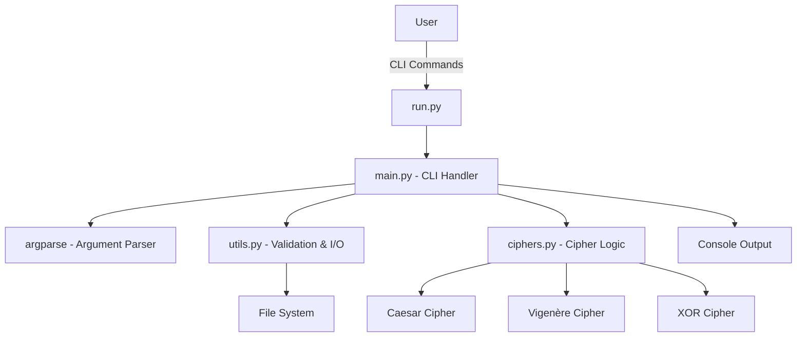

# Cipher Tool --Project Report

**Project:** py-Cipher-Tool  
**Author:** John Varghese (@Cyber_Trinity) J0X  
**Repo:** https://github.com/John-Varghese-EH/py-Cipher-Tool  
**Purpose:** A small, dependency-free Python CLI for learning classical ciphers.

---

## Executive Summary

Cipher Tool is a small but readable command-line utility that implements three old-time classic ciphers-Caesar, Vigenère, and XOR-for demonstrating the principles of encryption and decryption. It is meant for students, teachers, or those who want to try their hands at basic crypto: clear code, simple CLI, and without reliance on any external library packages.

## Overview

The project emphasizes clarity and reusability. Each single responsibility gets to be separated: The entry script starts the application, a CLI handler parses user input, cipher functions manage all transformations, and finally, the utilities group deals with file I/O and validation. The project focuses more on learning than production-grade security.

## Technical Architecture

## Key Features

- Caesar: simple shift substitution (integer key), preserves case and non-letters.  
- Vigenère: keyword-based polyalphabetic substitution, preserves formatting and advances the key only on letters.  
- XOR: byte-wise XOR for text or binary; the same operation encrypts and decrypts.  
- Modes: text (console) and file (read/write with correct binary/text handling).  
- No external dependencies — runs on Python 3.6+.

## Implementation Highlights

- Clear and well-documented functions in ciphers.py for each algorithm.  
- Utilities include safe file read/write and validators for each key type.  
- Basic error handling with helpful messages for invalid input or missing files.  
- Unit tests cover core round-trip behavior (encrypt → decrypt) and basic validation.

## Quick Usage Examples

- Encrypt text with Caesar:
  python run.py text encrypt caesar --key 3 --input "Hello World"

- Vigenère text example:
  python run.py text encrypt vigenere --key SECRET --input "ATTACK AT DAWN"

- XOR a binary file:
  python run.py file encrypt xor --key SecretKey --input image.png --output encrypted.bin

## Testing

A small unittest suite verifies cipher correctness and basic utils behavior. Tests guarantee that encrypting and then decrypting in turn recovers the original data for each supported cipher.

## Possible Enhancements

- Add more classical ciphers (ROT13, Atbash, Playfair)  
- Basic cryptanalysis tools (frequency analysis, brute force)  
- Optional GUI or small web front end for teaching  
- Improvements for large files (streaming) and batch operations

## Security Note

This project is strictly for educational purposes. Caesar, Vigenère, and XOR are not considered secure mechanisms to protect any real secrets. For real-life secure applications, use modern vetted algorithms (e.g. AES) and any well-known cryptography library.

---

John Varghese (@Cyber_Trinity) — https://github.com/John-Varghese-EH/py-Cipher-Tool

---

**End of Report**  
*Created: November 2025*  
*Version 1.0*
